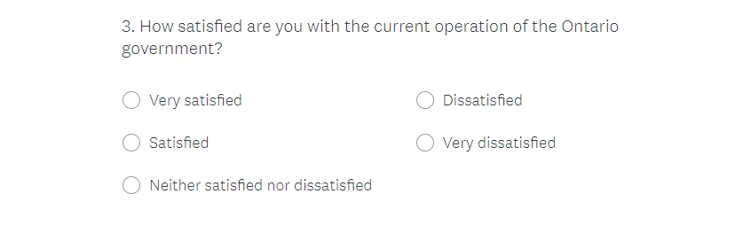
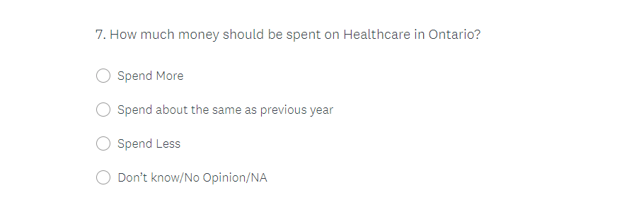

```{r setup, include=FALSE}
knitr::opts_chunk$set(echo = TRUE)
library(tidyverse)
```

# Executive  Summary

  Our team at Petit Poll has been approached by the New Democratic Party of Ontario to provide them with monthly polling updates during their campaign for the upcoming provincial election. We have been tasked with creating a survey that can best identify the most important issues to Ontarians and uncover what they want to see done about them. Using data gathered from a number of Canadian polling websites, we ran our survey through a simulation, using this polling data to apply different probability weights to each response, and generated what we feel is a representative sample of how real Ontarians would respond to these questions.
  
Through our simulation, we found that policies surrounding; increased funding to healthcare facilities, a proactive stance toward protecting Ontario’s environment, and decreased costs of hydroelectricity, could seriously help the NDP’s chances as they stand to benefit the majority of Ontarians. We also determined that citizens would like to see a restructuring of the tax system with increased taxes on the wealthy and lowered rates on the less fortunate. On the other hand, we found that Ontarians felt less enthusiastic about policies to increase minimum wage and welfare funding. As a result, we would advise against making these policies the headliners during the campaign and instead waiting until the NDP takes office to deliberate on them.

This study is of extreme importance to the NDPs since their greatly improved performance in the most recent election suggested the possibility of an NDP government in Ontario’s future. We believe that with the promise to enact the policies most important to Ontarians overall, the NDP will have the ability to garner the votes needed to take office again in Ontario. As winning an election can be considered the final goal of almost all political Parties, it is reasonable to assume that a study like this would be greatly beneficial to any Party hoping to gain power in Ontario.

While we took great care with determining the probability weights of each response, the fact that our survey was simulated by a computer means that we are unable to view the full variation in responses we would receive from human respondents. As a result, we cannot be completely sure of whether or not our data is representative of what Ontarians truly feel and this must be kept in mind when reviewing our conclusions and suggestions.

The easiest area for future work on this study is to bring this survey out into the real world and gather real person responses to our questions. This would go a long way toward getting our sample to be more representative of the total population. Furthermore, to provide definitive policy suggestions to the New Democratic Party, future surveys must be conducted with different questions to get a fuller picture of Ontarians’ opinions.


# Introduction

  Political issues and how Parties plan to go about solving them has shown to be a major factor in voting decisions in recent provincial elections. Voters attain this information through numerous media outlets and their vote is heavily dependent on which Party plans to solve issues that are of greatest importance to them. In result of this, Political Parties must pay close attention to voters' preferences and aim to solve issues that most concern them and stand to benefit the largest number of citizens.
  
In the most recent provincial election in Ontario, the New Democratic Party came in a close second to the Conservative Party with less than a 7% difference in final votes between the two. This is the closest the NDP has come to taking office in Ontario since 1990 under the power of Robert Keith Ray. From 1995 to 2014, elections in Ontario seemed to be a one-on-one battle between the Conservative and Liberal Parties with all other Parties fighting for third, but the new results from the 2018 election signify that the NDP may once again be able to gain power in Ontario. We believe that the answer to the NDP’s taking power again is their ability to enact meaningful policies that stand to benefit the largest number of Ontarians.

In order to determine what policies are most important to Ontarians, our team developed a survey aimed at a large range of popular issues in Ontario, asking participants for their personal opinions on the specific matters. This included questions such as; 'How important is the protection of Ontario's environment?' and 'How much money would you like to see go toward healthcare facilities?' Using data gathered from a variety of credible sources including Statistics Canada and I Side with Polls, we were able to determine rough estimates for the probability of answers to our survey and used these as parameters for our study. As we were unable to collect real person responses, we used these parameters to generate a simulated dataset of responses to our survey that we could work with and make conclusions from.

Through our simulation and results, we can determine which of our chosen issues Ontarians feel most strongly about. In turn, this allows us to make suggestions to the New Democratic Party on what issues they should highlight and pursue in the coming election. In doing so, the NDP will be able to campaign more efficiently by addressing these problems and falling back on policies less important to the population. As a result, this can mean that the NDP is able to get that extra 7% push it needed in votes to secure a position of power in Ontario and begin operating as they see fit.

Our findings suggest to us that the NDP should focus heavily on policies that; provide additional funding to healthcare facilities, improve the quality of Ontario's environment, and cut the costs of hydroelectricity for the province. In addition to this, it appeared that Ontarians desired a restructuring of the province's tax system, which could potentially help to close the income gap by taxing the rich and benefitting the poor. We also found that policies regarding increased minimum wage and welfare payments would not be as effective at gaining votes due to the strong differences in opinions on these matters. Despite these conclusions, we must first conduct further research through additional surveys before we can come to a definitive answer on the most effective policies for the Party.

# Code Discussion

```{r,echo=FALSE}
set.seed(314)
pop <- 11796032
survey_size <- 1000000
my_data2 <- tibble(
# Simulation for question "What is your age".
  Age = sample(x = 
                 c("18 to 24", "25 to 34", "35 to 44", 
                 "45 to 54", "55 to 64", "65 to 74",
                   "75+", "Prefer not to say")
               ,size = survey_size,replace = TRUE,
               prob = c(0.11, 0.152, 0.15, 0.18, 0.165,
                           0.11, 0.112, 0.02)),
# Simulation for question "How likely are you to vote in the upcoming election?".
  Likelyhood_Vote =sample(x = c("Very likely", "Likely",
                     "Unlikely", "Very Unlikely",
                     "Don't Know/Prefer Not to answer"),
               size = survey_size, replace = TRUE,
               prob = c(0.375, 0.375, 0.115, 0.115, 0.02)),

# Simulation for question "How satisfied are you with the current operation of the Ontario government?".
  Current_Gov =sample(x = c("Very satisfied", "Satisfied",
                     "Neither satisfied nor dissatisfied", 
                     "Dissatisfied", "Very dissatisfied"),
               size = survey_size, replace = TRUE,
               prob = c(0.01, 0.25, 0.05, 0.35, 0.25)),

# Simulation for question "What is your opinion on the Minimum Wage rate in the Province?".
  Min_Wage =sample(x = c("Too high", "Just right",
                     "Too low", "Don't care/NA"),
               size = survey_size, replace = TRUE,
               prob = c(0.20, 0.23, 0.54, 0.03)),

# Simulation for question "In your opinion, taxes for those with an income".
# Income less than $40,000.
  Taxes_low =sample(x = c("Should be Higher","Should Stay about the Same",
                     "Should be Lower", "Don't Care/NA"),
                     size = survey_size, replace = TRUE, 
                     prob = c(0.07, 0.24, 0.65, 0.04)),
# Income between $40,000 and $200,000.
  Taxes_mid =sample(x = c("Should be Higher", "Should Stay about the Same",
                     "Should be Lower", "Don't Care/NA"),
                     size = survey_size, replace = TRUE,
                     prob = c(0.08, 0.32, 0.55, 0.05)),
#Income greater than $200,000.
  Taxes_high = sample(x = c("Should be Higher", "Should Stay about the Same",
                     "Should be Lower", "Don't Care/NA"),
                     size = survey_size, replace = TRUE,
                     prob = c(0.67, 0.2, 0.08, 0.05)),

# Simulation for question "On a scale from 1 to 5, how important do you think the preservation of Ontario's environment is?".
  Environment =sample(x = c(1:5),
               size = survey_size, replace = TRUE,
               prob = c(0.1, 0.1, 0.1, 0.3, 0.4)),

# Simulation for question "How much money would you like to see go toward benefiting those on welfare?".
  Welfare =sample(x = c("Spend More", "Spend less",
                           "Spend about the same as previous year",
                            "Don’t know/No Opinion"),
               size = survey_size, replace = TRUE,
               prob = c(0.3, 0.25, 0.4, 0.05)),

#Simulation for question "How much money should be spent on Healthcare facilities in Ontario?".
  Healthcare =sample(x = c("Spend More", "Spend less",
                           "Spend about the same as previous year",
                            "Don’t know/No Opinion"),
                     size = survey_size, replace = TRUE,
                     prob = c(0.78, 0.10, 0.10, 0.02)),

# Simulation for question "What do you think about the current price of hydroelectricity in Ontario?". 
 Hydro =sample(x = c("Too expensive", "Too cheap",
                           "Fairly priced", "No Opinion"),
                     size = survey_size, replace = TRUE,
                     prob = c(0.75, 0.08, 0.15, 0.02)),

# Simulation for question "Through what avenue do you most judge a political candidate?". 
  Gather_info =sample(x = c("Candidate address and speeches", "Online news sources",
                        "TV", "Newspaper articles", "Social Media", "Other"),
                     size = survey_size, replace = TRUE,
                     prob = c(0.1, 0.25, 0.36, 0.5, 0.37, 0.03)),
)
```

To begin with, we gathered real world data surrounding the topics we chose for our survey and used this as a way to determine roughly what the probability of each response to our questions would be. Next, by using the sample() function in Base R, we designed a simulated version of our survey in R where the likelihood of each response matched the probabilities we calculated before.
We then generated a sample frame of 1,000,000 respondents to our survey and organized this into a dataset. Each column represents one of the questions from our survey while the rows represent an individual’s set of responses to the survey. In reality, we would never get to survey 1,000,000 people so, from this dataset, we randomly selected 5,000 rows (participants) and organized them into a new dataset used to represent what our actual sample size would look like. We felt that this might better display a variation in answers than sampling straight from our questions would have.

Below, we have provided a preview of what our final dataset looks like.
```{r, fig.cap = 'Table 1', echo=FALSE}
set.seed(314)
my_data <- sample_n(my_data2, 5000)
head(my_data)
```


Since our data has been simulated and designed by our team, there was almost no need for us to clean the data before we could continue with our work. Thus, using our simulated dataset, we are ready to carry on to analyzing the responses seen in our survey. 
Before then, however, we will cover the methodology of our survey in the next section.


# Survey methodology

The total population we are studying consists of all Ontarians above the age of 18, a total of approximately 11,796,032 people. For our sampling frame, we generated a list of all emails registered to Ontarians above 18 years old. Lastly, our sample consists of 5,000 random selections from this sampling frame.

To generate our sample we chose to use a method of simple random sampling without replacement and there were a couple reasons for this. For starters, Ontario is split up into 52 different cities which would be extremely difficult to stratify across. Moreover, we cannot stratify by factors like age or gender either since this data is unavailable to us prior to conducting our survey. Thus, we have decided that simple random sampling without replacement (SRSWOR) would be our chosen method of sampling for this survey. This method is as simple as the name states as all that is required for us to do is randomly select participants from our sampling frame to include in our final sample. We favour SRSWOR due to both its simplicity of implementation and ability to provide a representative sample of the total population while using a relatively small sample size. 

Administration will be carried out online by contacting all of our selected participants through email with a link to our online survey. By conducting the survey online instead of in person or through the mail, we will be able to save a lot on field costs in the process as we can practically eliminate our need to travel for results. Because we are able to save with this method, we have decided to also add in a monetary incentive for respondents to complete our survey. At the end of our survey, respondents will be given the choice of a $5-$10 voucher for a variety of stores in their area including; restaurants, grocery stores, shopping malls, etc. Thus, in total, we estimate that this survey will cost between $25,000 and $35,000 to conduct, including both the cost of delivering and receiving the results and the cost of our monetary incentive for respondents.

Since this is not a mandatory survey, non-response can cause a serious problem with the data we receive by reducing our real sample size and in the worst case, causing a bias in responses to one answer. This can lead to our results not being very representative of the total population thus rendering our conclusions less helpful. In order to protect against this, on every question we provide respondents with an option ‘prefer not to say’ or ‘don’t know’ so that they are not forced to answer or share anything that they are uncomfortable with, which often leads to early departures from surveys. To stop participants from tiring during the survey and leaving early, we have kept our survey relatively short to where they will be able to quickly complete it within 1-2 minutes and move on with their day. Along with our short survey, we designed our questions to be as simple as possible to answer, encouraging thought about important issues in Ontario, without confusing any of the participants. Lastly, the coupon we offer upon completion of our survey is likely to keep participants answering and prevent some of the less interested ones from quitting.
With respect to our respondents’ privacy, we have kept the number of personal questions to a minimum so that they can remain unidentifiable by their answers, and in addition, we censor all of their emails when we view and report on the results of the survey. We will also provide each emailed participant with a unique password that they can use to access our survey ensuring that no external members can gain any access to it.


# Results

In this section, in order to determine which issues are most important to voters, we will be analyzing the results from our survey by displaying the responses in bar graphs.

```{r,fig.cap = 'Figure 1' ,echo=FALSE,warning=FALSE}
# Bar Graph for question "How satisfied are you with the current operation of the Ontario government?"
my_data %>%
  ggplot(aes(x = Current_Gov)) + 
  geom_bar(color = 'black', fill = 'Green') + 
  labs(title = "Voters' Satisfaction with Current Government", 
       x = "Level of Satisfaction", 
       y = "Number of Responses",
       caption = "Figure 1 - Source: Simulated dataset.") + 
  theme_minimal() + 
  theme(axis.text.x=element_text(angle=45,hjust=1))
```
To begin with, in Figure 1, we plot the responses to the question "How satisfied are you with the current operation of the Ontario government?" As we can see from our graph, a very large proportion of Ontarians are dissatisfied or very dissatisfied with the current government. While this is not ideal for the population, this is quite promising for the New Democratic Party as it suggests that most people in Ontario are looking for a change in the government. Thus, with the right set of policies, the NDP can capitalize on the number of unsatisfied voters and potentially gain a significant number of votes in the coming elections.

```{r, fig.cap="Figure 2",echo=FALSE,warning=FALSE}
#Bar graph for question "What is your opinion on the Minimum Wage rate in the Province"
my_data %>%
  ggplot(aes(x = Min_Wage)) + 
  geom_bar(color = 'black',fill = "yellow") + labs(title="Voter Opinions on the Current Level of Minimum Wage",
       x = "Opinion on current Minimum Wage",
       y = "Number of Responses",
       caption = "Figure 2 - Source: Simulated dataset.") +
  theme_minimal()
```
In Figure 2, we examined responses to the question “What is your opinion on the Minimum Wage rate in the Province”. As we can see, the majority of voters, approximately 54%, believe that the current minimum wage is too low and should be raised by the provincial government. However, this is not a strong majority as the remaining 46% of people believe it is either just right or too high. From studying other surveys, we find people feel that increasing the minimum wage will cause prices to increase in a never-ending cycle, consequentially hurting themselves. These results suggest that promising to increase the minimum wage would be a fairly controversial statement as voters are almost relatively split on the matter. In turn, it is likely that the gain in voters seen from a policy like this would not be sufficient to outweigh the loss of voters as a result.

```{r, fig.cap="Figure 3.1",echo=FALSE,warning=FALSE}
# Bar plot for question "In your opinion, taxes for those with an income:Less than $40,000"
my_data %>%
  ggplot(aes(x = Taxes_low)) + 
  geom_bar(color = 'black',fill = "orange") + 
  labs(title="Income Tax Rate Reccomendation for 
       Annual Income under $40,000 by Voters",
       x = "Reccomendation on Tax Rate",
       y = "Number of Responses",
       caption = "Figure 3.1 - Source: Simulated dataset.") +
  theme_minimal()
```
```{r, fig.cap="Figure 3.2",echo=FALSE,warning=FALSE}
#Bar plot for question "In your opinion, taxes for those with an income:Between $40,000 and $200,000"
my_data %>%
  ggplot(aes(x =Taxes_mid )) + 
  geom_bar(color = 'black',fill = "orange") +
  labs(title="Income Tax Rate Reccomendation for 
       Annual Income between $40,000 and $200,000 by Voters",
       x = "Reccomendation on Tax Rate",
       y = "Number of Responses",
       caption = "Figure 3.2 - Source: Simulated dataset.") +
  theme_minimal()
```
```{r, fig.cap="Figure 3.3",echo=FALSE,warning=FALSE}
# Bar plot for question"In your opinion, taxes for those with an income:Greater than $200,000"
my_data %>%
  ggplot(aes(x = Taxes_high )) + 
  geom_bar(color = 'black',fill = "orange") + 
  labs(title="Income Tax Rate Reccomendation for 
       Annual Income over $200,000 by Voters",
        x = "Reccomendation on Tax Rate",
        y = "Number of Responses",
        caption = "Figure 3.3 - Source: Simulated dataset.") +
  theme_minimal()
```
Figures 3.1-3.3 display the results from our three part question on tax rates for the lower, middle, and upper classes in Ontario. As we can see, there is a strong majority of Ontarians that wish for a reconstruction of the tax system in the province. It appeared that over 65% of respondents suggested that tax rates are brought down for those earning under 40,000 dollars per year. On the other side, we also found that over 65% of voters encouraged an increase in tax rates on those earning above 200,000 dollars per year. For levels of income between 40,000 and 200,000, we found that a slightly smaller majority, as 55% desired a lower tax rate while 30% wanted rates not to change. As a result of this, it is strongly encouraged that the NDP look for ways they can begin to alter tax rates to benefit the less fortunate. It is likely that policies surrounding this would be highly effective at both gaining new voters for the Party and aiding the province's attempts to shrink the income gap.


```{r,fig.cap='Figure 4',echo=FALSE, warning=FALSE}
#Bar plot for question "How much money should be spent on Healthcare in Ontario?"
my_data %>%
  ggplot(aes(x = Healthcare)) + 
  geom_bar(color = 'black',fill = "steelblue") +
  labs(title="Healthcare Spending Reccomendation by voters",
         x = "Spending Reccomendation", 
         y = "Number of Responses",
         caption = "Figure 4 - Source: Simulated dataset.") + 
  theme_minimal() + 
  theme(axis.text.x=element_text(angle=45,hjust=1))
```
In our next graph, Figure 4, we displayed the responses to the question “How much money should be spent on Healthcare facilities in Ontario?”. The results to this question were a lot more one-sided in comparison to our previous graph as almost 80% of voters agreed that there should be an increase in spending in the healthcare sector. These results are not surprising, as unlike an increase in the minimum wage, everyone can seek to benefit from an increase in healthcare funding. This suggests that improvements, such as spending on healthcare facilities and assessing the overcrowding of hospitals, could go a long way toward garnering more votes in the election. We highly recommend that the NDP Party consider improvements to the healthcare sector, as one of their main focuses in the upcoming election. 

```{r,fig.cap='Figure 5',echo=FALSE,warning=FALSE}
# Bar plot for question "How much money would you like to see go toward benefiting those on welfare"
my_data %>%
  ggplot(aes(x = Welfare)) + 
  geom_bar(color = 'black',fill = "steelblue") + 
  labs(title="Welfare Spending Reccomendations by Voters",
       x = "Spending Reccomendation",
       y = "Number of Responses",
       caption = "Figure 5 - Source: Simulated dataset.") +
  theme_minimal() + 
  theme(axis.text.x=element_text(angle=45,hjust=1))
```
In Figure 5, we display responses to the question “How much money would you like to see go toward benefiting those on welfare?” These results were surprising as it appears that most Ontarians favour keeping welfare funding at the level it currently is with an even more surprisingly high number of respondents suggesting that spending was reduced in this sector. While we still see a large proportion of respondents insisting on increases to funding, this does not come close to outweighing the proportion of participants that were against this idea. Thus, it is clear that enacting a policy to increase welfare payments would do more harm than good for the NDP’s chances of winning.

```{r,echo=FALSE,warning=FALSE}
# Bar plot for question "On a scale from 1 to 5, how important do you think the preservation of Ontario's environment is?"
my_data %>%
  ggplot(aes(x = Environment)) + 
  geom_bar(color = 'black',fill = "steelblue") + 
  labs(title="Importantance of Protecting the Environment to Voters",
       x = "Level of Importance",
       y = "Number of Responses",
       caption = "1 = Not Important, 5 = Very Important.                 Figure 6 - Source: Simulated dataset.") +
  theme_minimal()
```

For our next graph we present the responses to the question “On a scale from 1 to 5, how important do you think the preservation of Ontario's environment is?”. Like figure 4, figure 6 also displays a majority in votes supporting the issue at hand. Around 70% of the responses highly valued the protection of the environment with a minority of respondents showing little to no care. Thus, we find that the preservation of the environment in Ontario would be a good issue for the NDP Party to consider focusing on. Some ways that the government could go about safeguarding the environment are investing in the production of renewable energy sources and spending time and resources on increasing regulations on large businesses to reduce carbon emissions.

```{r,fig.cap='Figure 7',echo=FALSE,warning=FALSE}
# Bar plot for the question "What do you think about the current cost of hydroelectricity?"
my_data %>%
  ggplot(aes(x = Hydro)) + 
  geom_bar(color = 'black',fill = "firebrick1") + 
  labs(title="Opinions on current Hydroelectricity Prices in Ontario",
       x = "Opinion",
       y = "Number of Responses",
       caption = "Figure 7 - Source: Simulated dataset.") +
  theme_minimal()
```
In Figure 7, the responses to the question “What do you think about the current cost of hydroelectricity?” have been displayed. As seen above, almost 75% of voters felt that hydroelectricity prices in Ontario are too expensive. This is not surprising at all however, since Hydro One was privatized back in 2015, prices have drastically increased over time, negatively affecting many households. Since this issue affects pretty much everyone in Ontario, we would strongly encourage that the NDP also focus on promising a possible solution to the high prices if elected. The most obvious remedy to this issue is to make Hydro One public as the privatization of the company is the reason prices are high and will continually get higher if nothing is done to restrict their monopoly.

```{r, fig.cap='Figure 8',echo=FALSE,warning=FALSE}
#Bar plot for the question "Through what avenue do you most judge a political candidate?"
my_data %>%
  ggplot(aes(x = Gather_info)) + 
  geom_bar(color = 'black',fill = "deepskyblue") + 
  labs(title="Oulets that voters use most to judge a candidate",
       x = "Media Outlets",
       y = "Number of Responses",
       caption = "Figure 8 - Source: Simulated dataset.") + 
  theme_minimal() + 
  theme(axis.text.x=element_text(angle=45,hjust=1))
```
As seen in our final graph, we displayed the responses to the question  “Through what avenue do you most judge a political candidate?” We noticed that responses to this question were fairly evenly spread among all of the categories, thus the NDP needs to make sure their political information is spread thoroughly and truthfully through each media outlet. The emergence of Social Media and the effect it has on the votes of young people has become significant in recent years as many voters rely on it as their primary source of political information. As such, the NDP must make sure that their message is properly addressed across all social media platforms. Unfortunately, with the strong effect the media has in politics today, it is extremely important that the NDP ensure their policies are being properly represented as misrepresentation and misinformation can seriously sway votes away from one Party to another.

# Discussion

Through our survey and analysis, we can start to determine which issues are the most important and make suggestions on policies that would benefit the greatest number of Ontarians. Our results showed that a strong majority of Ontarians want to see increased funding to the healthcare sector, increased attention to protecting the environment, and decreased hydroelectricity prices. To address healthcare funding, we would make a strong recommendation to increase the number of hospital beds in Ontario to aid with issues of overcrowding and put an end to hallway medicine. Preserving the environment is a much longer term goal but we feel that a good area to start in is the restriction of mass carbon pollution from factories across Ontario. Solving the issue of hydroelectricity prices will likely first require the acquiring of Hydro One from private hands. The monopoly that Hydro One currently has is too easily able to take advantage of citizens and charge what they please, bringing this company public would allow the government to enforce stronger price restrictions and ultimately cut the cost to Ontarians. In addition to this, we found that Ontarians also desired a restructuring of the tax system in the province. Overall, increasing taxes on the wealthy and decreasing rates for the middle and lower classes can seriously benefit the majority of Ontarians and thus should definitely be addressed during the campaign. On the other hand, we found that Ontarians were less favourable for increases to minimum wage and welfare funding. As a result, we would advise against displaying these policies during campaigning and wait until after taking office to deliberate.

Still, further research will certainly be necessary to pin down exactly what policies will be the most efficient at gaining votes for the Party. A good place to start with this would be to include an additional question in our survey asking if respondents would be open to taking part in future surveys. This would be extremely beneficial since we will be able to gather a sample that we can rely on to provide responses. 

# Weakness and areas for future research

The most prominent limitation to our study was our inability to deliver our survey to real people forcing the use of simulated data. While the parameters for our questions were carefully studied from real world sources, we cannot account for the real world variation we’d see in our answers. We will end up with responses very close to past years which can result in our sample not being completely representative of the total population. 
We would’ve also liked to give different probability weights to answers based on previous answers by the same respondent. For example, we know that males and females will respond differently to questions about the protection of the environment and this would be extremely beneficial to include in our study. Furthermore, the age ranges of participants would almost certainly make a difference in their responses to a number of questions. Including these conditional probabilities would go a long way toward making our sample more representative of the population of Ontario.
Furthermore, since we had to account for non-response, we were forced to keep our survey relatively short and ask only a few important questions. While this uncovers some of the most important issues to Ontarians, there is a sea of other issues that we must also pay attention to. This will likely require the conducting of additional surveys focused on different issues so that we can begin to get a full picture of our policy options. This can most easily be accomplished by including an additional question at the end of our survey asking whether or not respondents would be open to taking more surveys from us. In doing so we could develop a pool of respondents that we can rely on for opinions regarding a much wider range of issues and policies to solve them.
Due to the fact that we were also required to keep our questions simple, this leaves a lot of work for the New Democratic Party when deciding on policies. As we could not realistically ask how Ontarians would respond to every policy option available, the NDP must infer from our data the general direction voters want a specific issue to go, and use their best judgement to determine what policy can best accomplish this.
Lastly, to make improvements to the visuals of our study, we would have liked to clean our bar graphs up so that responses could easily be seen below each bar. Additionally, this would mean that we would not have had to rotate our longer responses and they would not have ended up taking a large portion of the graph's space. This, ultimately, would make the entire story more visually appealing which is of great importance when we provide companies with our findings.


# Appendix
 
 Code for this study can be found at: https://github.com/jordanregis/STA304PS2Survey/blob/main/Appendix.Rmd

A discussion for how we determined the probability weights for each response is included at: https://github.com/jordanregis/STA304PS2Survey/blob/main/Probability%20Discussion  

# References 
 cesR web file (ces2015_web) - Fournier, Patrick, Fred Cutler, Stuart 
  Soroka and Dietlind Stolle. 2015. The 2015 Canadian Election Study.
  [dataset] LINK: https://ces-eec.arts.ubc.ca/english-section/surveys/
  
  Elections Canada (n.d.), Estimation of Voter Turnout by Age Group.
  from, https://www.elections.ca/content.aspx?section=res
  
  ISideWith (2020). Political Issues of 2020. 
  from https://canada.isidewith.com/polls
  
  R Core Team (2020). R: A language and environment for statistical
  computing. R Foundation for Statistical Computing, Vienna, Austria.
  URL https://www.R-project.org/.
  
  SurveyMonkey Inc. San Mateo, California, USA, 
  www.surveymonkey.com
  
  Sevunts, L. (2019, April 09). Canadians get news from social media: Poll,
  from, https://www.rcinet.ca/en/2019/04/09/canadians-social-media-news-poll/
  
  Statistics Canada. (2019, June 18). Census Profile, 2016 Census Canada. 
  from https://www12.statcan.gc.ca/census-recensement/2016/dp-pd/prof/details/Page.cfm?Lang=E
  
  Wickham et al., (2019). Welcome to the tidyverse. Journal of Open
  Source Software, 4(43), 1686, https://doi.org/10.21105/joss.01686
  
# Survey Link
 Survey conducted for this study can be found at:
 https://www.surveymonkey.com/r/3JM565P 

Screenshots of our survey questions can be found below. 

```{r, echo=FALSE}





knitr::include_graphics('Question 6.png')



```
